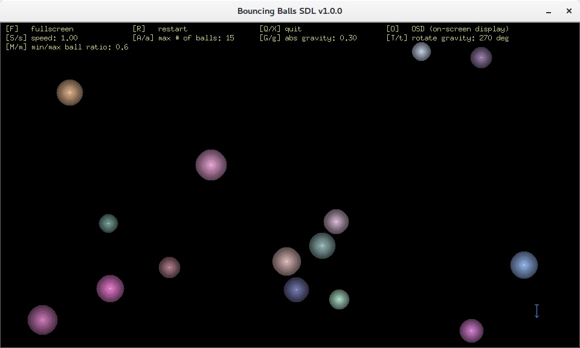

# balls-sdl

Bouncing balls demo written in Go. It uses [SDL2](https://www.libsdl.org/)
for graphics and events through the [go-sdl2](https://github.com/veandco/go-sdl2) Go binding.

You can find a rewrite of this using [go.wde](https://github.com/skelterjohn/go.wde) for graphics and events instead here:
[github.com/icza/balls-wde](https://github.com/icza/balls-wde).

Screenshot:

